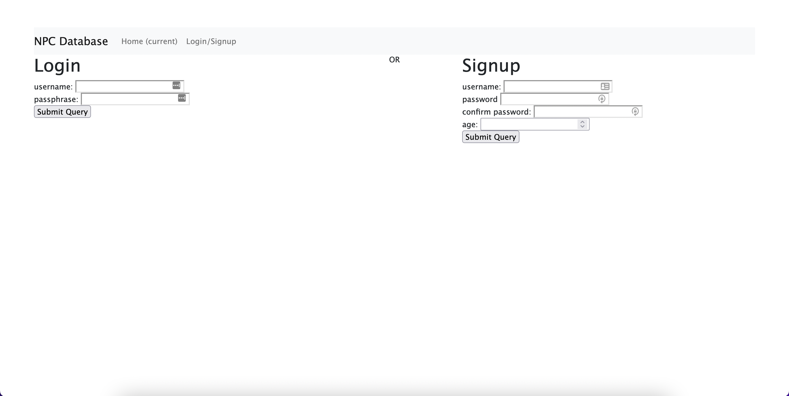
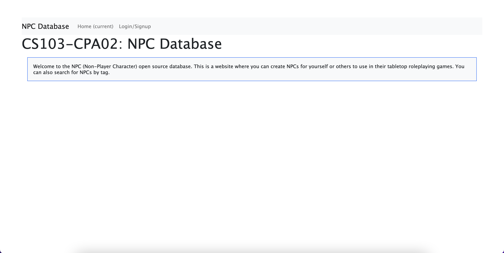
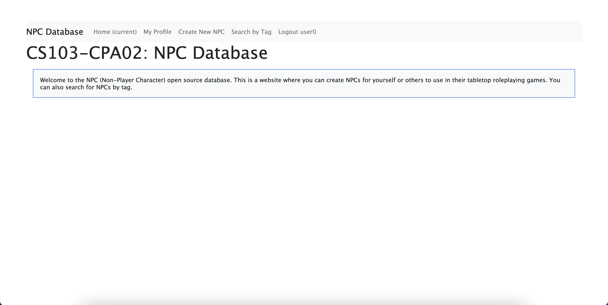
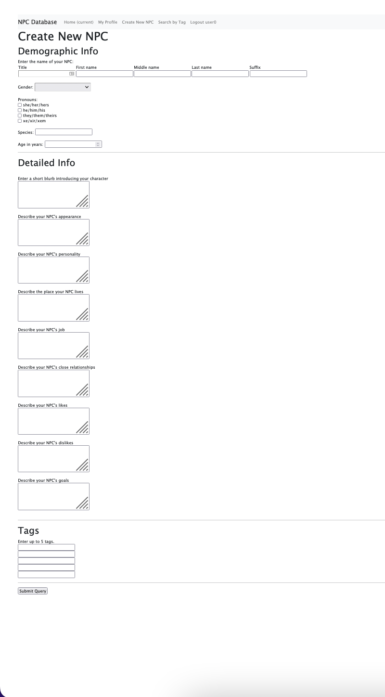
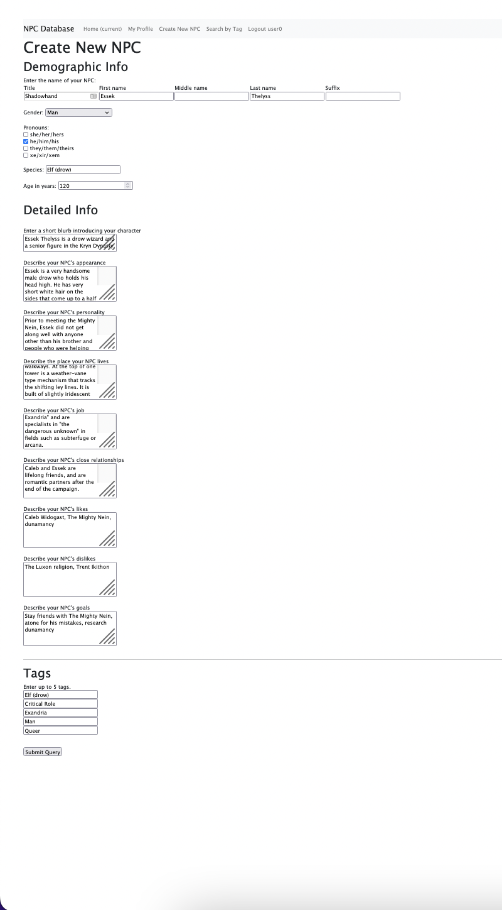
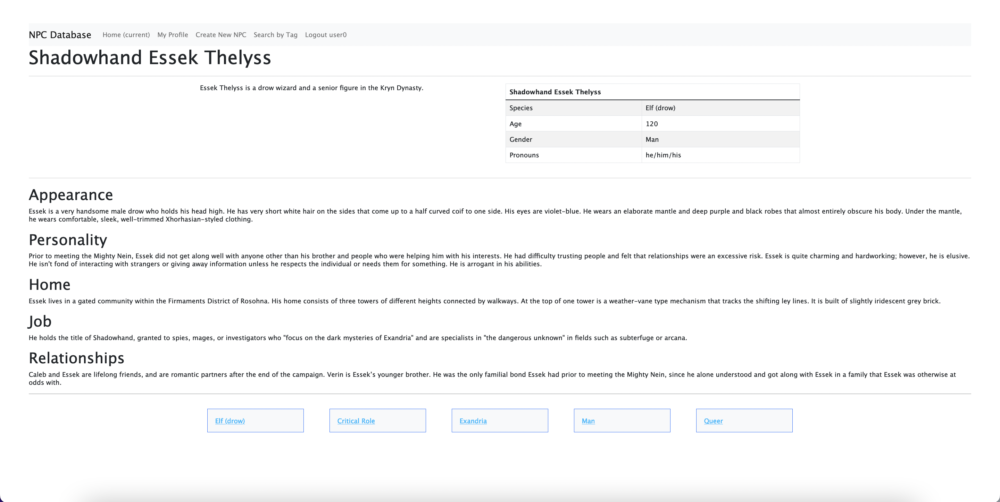
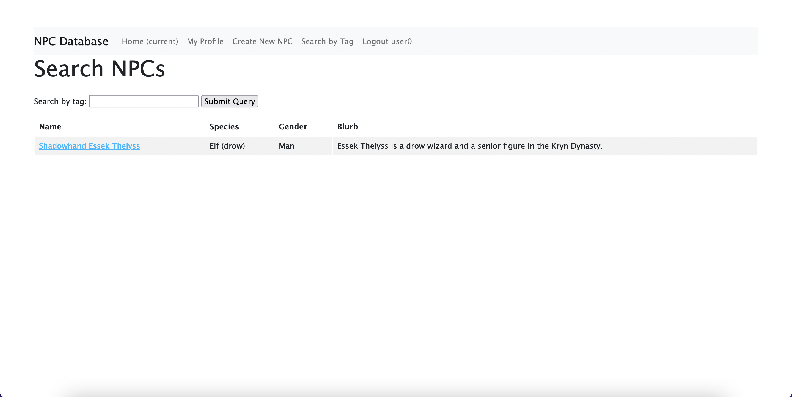
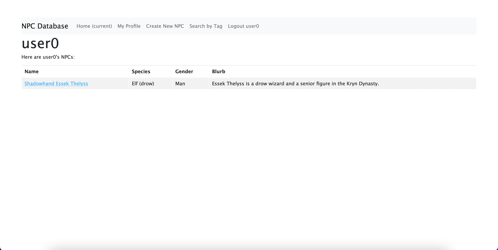

# cs103a-cpa02: NPC Opensource Database
Available at: https://npc-opensource-database.herokuapp.com/

## Guide to the App
https://drive.google.com/file/d/1OANAHE0OdMgxSfp2WJ_kxiv96VdInVzZ/view?usp=sharing

### Start by logging in:

| Not Logged In | Logged In    |
|---------------|--------------|
|   |  |

### Create an NPC by clicking "Create New NPC" on the header
| Empty        | Filled In    |
|--------------|--------------|
|  |  |

### This will then display the resulting NPC page


### You can search for an NPC by tag


### Or look at your user profile and see all the NPCs you've made


## Installation to run the app locally
1. Download this project from Github
2. Download Node.js and npm from https://nodejs.org
3. Change directory into the folder containing this project with
``` bash
cd cs103a-cpa02
```
4. Install the packages with
``` bash
npm install
```
5. Start the project with
``` bash
node app.js
```
6. Open your browser and enter http://localhost:5000/ as the URL

## Credits
This project was created from the PA3 branch of https://github.com/tjhickey724/cs103aExpressApp, which is a starter project which has a simple authentication module
and provides access to a mongoose database in the cloud.
